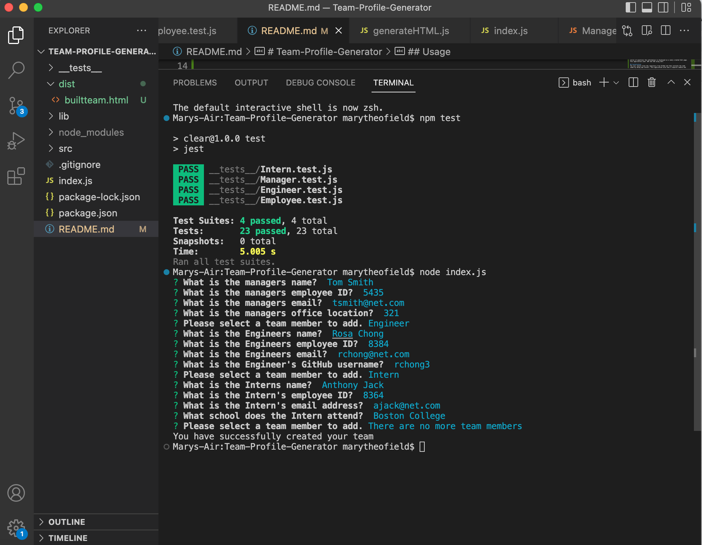

# Team-Profile-Generator

## Table of contents
- [Description](#description)
- [Installation](#installation)
- [Usage](#usage)
- [Contribute](#contribute)
- [Tests](#tests)
- [Questions](#questions)

## Descripton
The purpose of this project was to generate a team profile based on a user input using the Inquirer module from Node.js. When the user completes the series of questions the information is displayed on a newly created html page. This application used  OOP and TDD using Jest.

## Installation
The user should clone the repository from GitHub and then initiate the node index by doing npm install. This application also uses a inquirer module and for test this application uses Jest.

## Usage 
   This allows a user to quickly generate a README by using a command-line application to generate the file.  Inquirer package is used for this project. To ensure the README generates properly please answer all of the prompt questions. 

   Example of the integrated terminal
   

  Example of completed team that was Built on the server
   
    A demo for this can be found here (https://drive.google.com/file/d/1g-47TltkgEVicQq22eZL-5KW0grYTtEz/view)

## Contribute 
  There were no other collaborators for this project. 
  
## Tests
  There are no tests for this application.

## Questions

  If there are any questions about this project project, contact me at
  [$GitHub: [Mtheofield](https://github.com/Mtheofield)
  Email: [mptheofield@gmail.com](mailto:mptheofield@gmail.com)
  